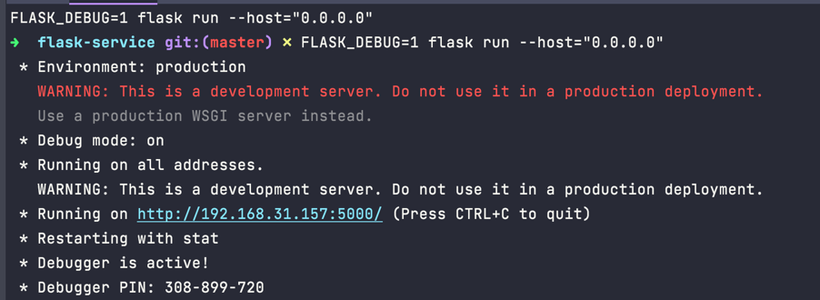
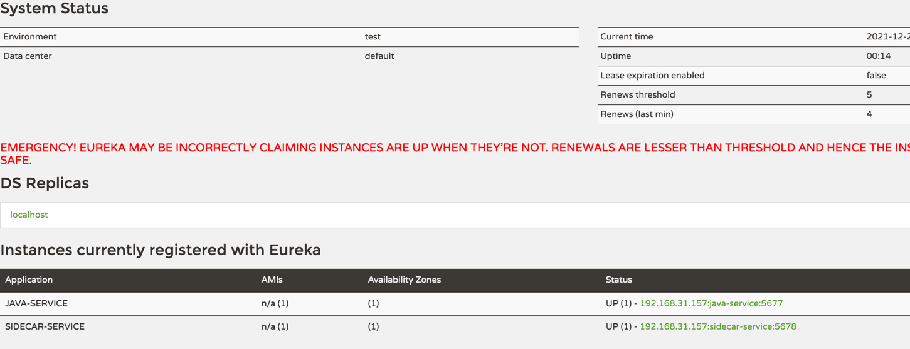

# Sidecar 异构服务调用demo

如下顺序依次运行

- `eureka`
- `flask-service`，[运行方式参考](flask-service/readme.md)
- `sidecar-service`
- `java-service`

## Python服务运行成功截图


## Eureka界面截图


## 检验服务是否运行成功

```shell
# 调用成功则表示java 调用python服务成功
curl http://192.168.31.157:5679/test/other
```
